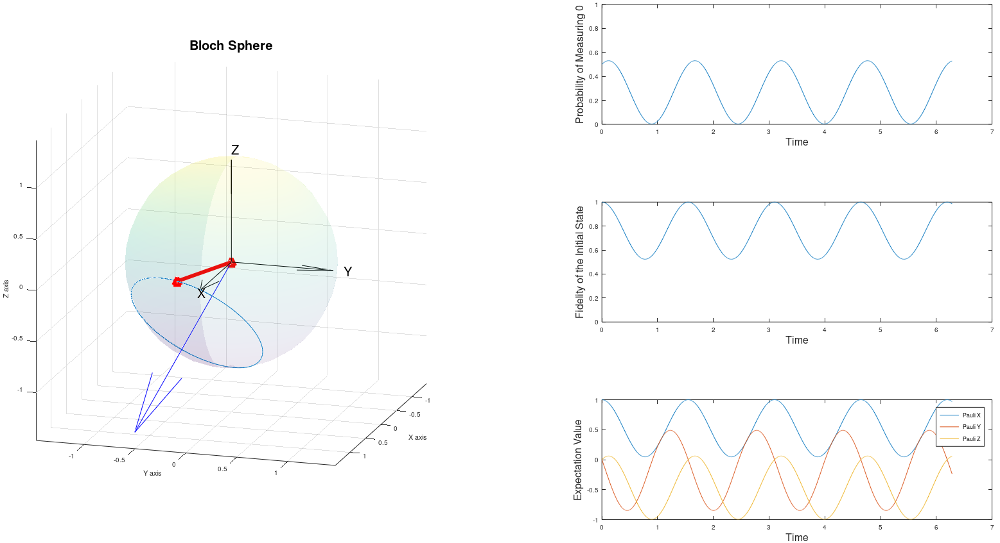

# Qubit Magnetic Field Precession
A MATLAB script visualizing the time evolution of a qubit under a static magnetic field.  
More generally, the script also represents the precession of the spin of a particle about a magnetic field (a case of Larmor precession).  
## The Visualization

The visualization includes:
 - a Bloch sphere representation of the qubit
 - a plot of the probability of measuring 0 over time
 - a plot of the fidelity of the initial state over time
 - a plot of the expectation values of the Pauli X, Y, and Z operators over time  
  
Bloch sphere features:
 - the red vector/line represents the qubit state
 - a blue line is traced out by the state vector (showing its path)
 - the blue vector/arrow represents the magnetic field
 - the black arrows represent the axes
  
The magnetic field is randomized but can be set by changing the B vector.  
The initial state is |+> but can be set by changing the psi_0 vector.  
